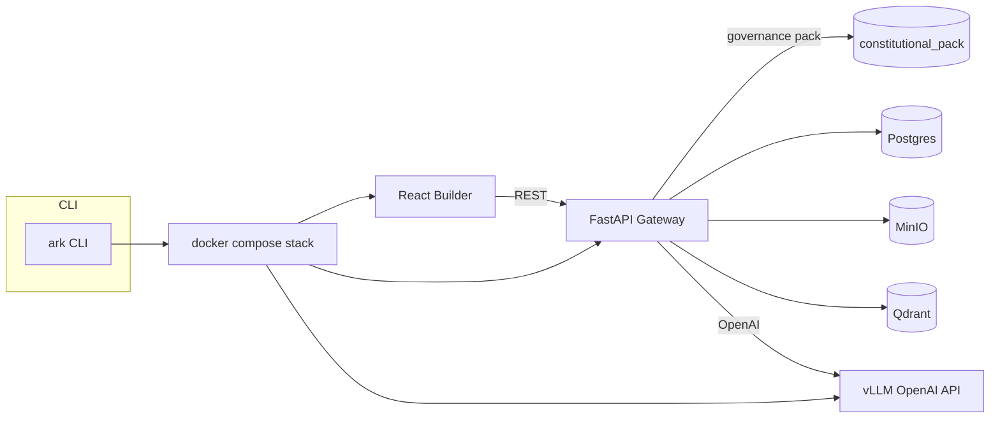

# Architecture

* **Dev experience** – the `.devcontainer` image mirrors the runtime
  requirements (CUDA 12.x, Python 3.11, Node.js 20) while bundling pipx, poetry,
  uv, make, git, and git-lfs. VS Code (or any devcontainer-compatible editor)
  attaches with GPU access enabled via the NVIDIA Container Toolkit.
* **Runtime** – `docker-compose.yml` launches vLLM (serving
  `Qwen/Qwen2.5-Coder-14B-Instruct` through an OpenAI-compatible API), the FastAPI
  gateway, the React builder, and supporting datastores (Postgres, MinIO, Qdrant)
  with health checks and startup ordering.
* **Governance pack** – mounted read-only into the gateway, the constitutional
  pack is surfaced through `/court/trifecta` and exposed in the builder UI.
* **CLI tooling** – `scripts/ark` wraps environment checks, compose orchestration,
  and helper workflows (logs streaming, court request helper, placeholder
  codegen). `scripts/check_env.sh` validates GPU visibility and port availability
  before the stack is started.
